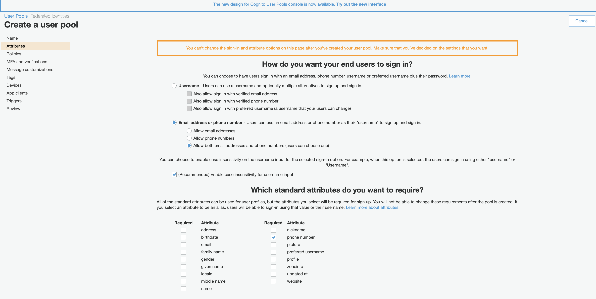
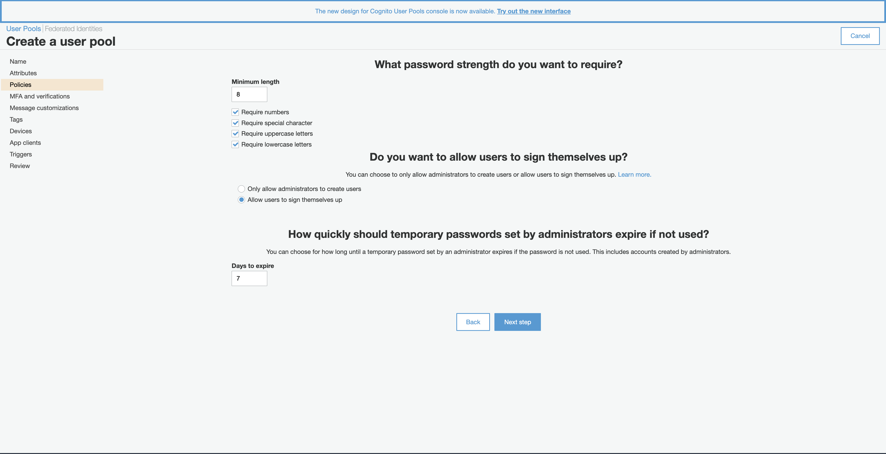
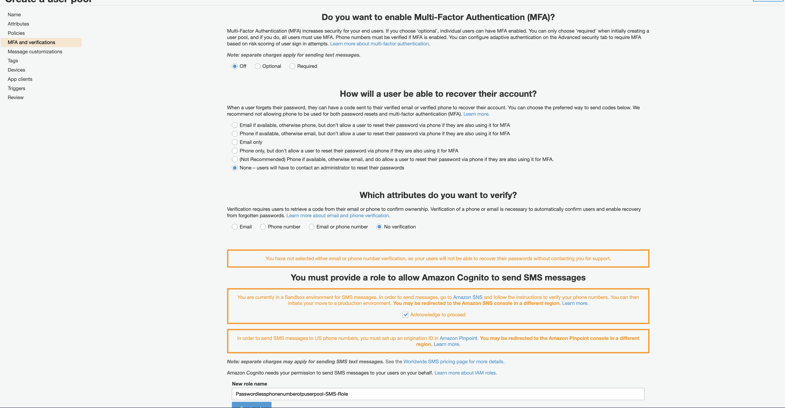
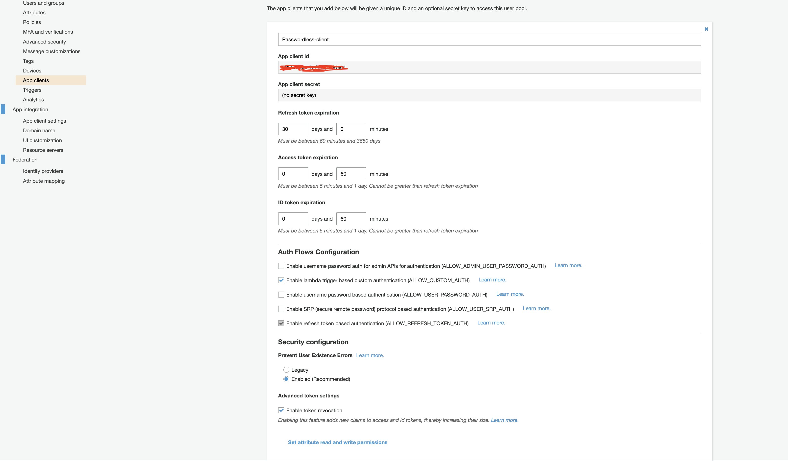

# Passwordless Authentication with OTP(SMS) using AWS Cognito

In passwordless authentication, a user needs to remember only their username which is usually a phone number or email. The process is similar to recovering a forgotten password but shorter and quicker.

When a user enters their phone number, they will receive a one time password (OTP) to their phone then they have to enter it on the next screen.

## Creating Cognito User Pool

### Attributes

We want our users to use their phone numbers as the username. Hence in the attributes section, choose “**Email address or Phone number” **and under that choose “ **Allow Phone numbers”** .

To make our sign up process even simpler we won’t require any standard or custom attributes from the user.



### Policies

The only thing that matters in this section is to “ **Allow users to sign themselves up** “.



### MFA and Verifications

We don’t have MFA for passwordless authentication, hence make sure “ **Off** ” is selected.

Account recovery is also not applicable for us, so we will select “ **None – users will have to contact an administrator to reset their passwords** “.

We don’t need verification as well, because the phone number is implicitly verified every time user signs in using the OTP. Select “ **No Verification** “.



### App Clients

Click “ **Add an App Client”** . Provide a name for the App Client and make sure you uncheck “ **Generate Client Secret** “.

AWS Cognito doesn’t support passwordless authentication out of the box. So, we will select “ **Enable lambda trigger-based custom authentication** ” and uncheck other configurations.



## Custom authentication challenge Lambda triggers diagram


## Custom Authentication Flow

Custom authentication flow are be implemented using the Cognito triggers and lambdas. We have to write lambda function for each step in the authentication flow. Following steps describe our authentication flow:

1. User will enter the phone number, and click Login.
2. User pool will receive the phone number, it will then call the “ **Define Auth Challenge** ” lambda. This lambda is responsible to drive the entire authentication flow. It determines which custom challenge needs to be created. In our case, the custom challenge will be to send and verify OTP.
3. User pool will then call “ **Create Auth Challenge** ” lambda function. This lambda will generate a OTP and sends it as an SMS.
4. User will then retrieve and enter the OTP.
5. User pool will then call “ **Verify Auth Challenge** ” lambda function. This lambda is responsible to check if the OTP user has entered is correct or not.
6. User pool will then again call “ **Define Auth Challenge** ” to check whether the user has completed all the challenge. In case of Multi-factor authentication there will be multiple challenges.
7. Once all the challenges are completed, user will be logged in successfully.

In the `lambda-functions` folder were provided simple code examples of the implementation of the lambda functions, with corresponding tiger names, that can be added to the AWS Cognito as triggers to implement the passwordless authentication with phone number using SNS service to send the passcode by SMS.

## Create Auth challenge Lambda trigger parameters

```json
{
    "request": {
        "userAttributes": {
            "string": "string",
            . . .
        },
        "challengeName": "string",
        "session": [
            ChallengeResult,
            . . .
        ],
        "clientMetadata": {
            "string": "string",
            . . .
        },
        "userNotFound": boolean
    },
    "response": {
        "publicChallengeParameters": {
            "string": "string",
            . . .
        },
        "privateChallengeParameters": {
            "string": "string",
            . . .
        },
        "challengeMetadata": "string"
    }
}
```

Find more info [here](https://docs.aws.amazon.com/cognito/latest/developerguide/user-pool-lambda-create-auth-challenge.html#cognito-user-pools-lambda-trigger-syntax-create-auth-challenge)

## Define Auth challenge Lambda trigger parameters

```json
{
    "request": {
        "userAttributes": {
            "string": "string",
                . . .
        },
        "session": [
            ChallengeResult,
            . . .
        ],
        "clientMetadata": {
            "string": "string",
            . . .
        },
        "userNotFound": boolean
    },
    "response": {
        "challengeName": "string",
        "issueTokens": boolean,
        "failAuthentication": boolean
}
```

Find more info [here](https://docs.aws.amazon.com/cognito/latest/developerguide/user-pool-lambda-define-auth-challenge.html)

## Verify Auth challenge Lambda trigger parameters

```json
{
    "request": {
        "userAttributes": {
            "string": "string",
            . . .
        },
        "privateChallengeParameters": {
            "string": "string",
            . . .
        },
        "challengeAnswer": {
            "string": "string",
            . . .
        },
        "clientMetadata": {
            "string": "string",
            . . .
        },
        "userNotFound": boolean
    },
    "response": {
        "answerCorrect": boolean
    }
}
```

Find more info [here](https://docs.aws.amazon.com/cognito/latest/developerguide/user-pool-lambda-define-auth-challenge.html)

## **CDK**

1. Go to the ` cdk` directory - `cd cdk`
2. In `./bin/cdk.ts` replace the ACCOUNT_NUMBER by your AWS account number
3. Configure your AWS CLI and add the access key and secret key of your AWS account with proper permissionsConfigure your aws cli and add access key and secret key of your aws account with proper permission
   Example:
   `export AWS_ACCESS_KEY_ID=YOUR_ACCESS_KEY export AWS_SECRET_ACCESS_KEY=YOUR_SECRET_KEY export AWS_REGION=YOUR_REGION`
4. In the `cdk` directory run command
   1. `yarn`
   2. `yarn cdk bootstrap`
   3. `yarn cdk deploy`
5. After the successful deployment, you will be able to see the configured Cognito UserPool with the client and assigned proper lambda function triggers in your AWS ConsoleAfter the successfule deployment, you will be able to see the configured Cognito UserPool with the client and proper lambda function triggers in your AWS Consol

## **Web client(Angular)**

You can use provided web client to test your setups.

How to use:

1. Go to the `client/web` dierectory
2. In `src/environments/environment.ts` replace the `YOUR_REGION`, `YOUR_USER_POOL_ID` and `YOUR_CLIENT_ID` with the proper values
3. Run the web client
   1. `yarn`
   2. `yarn start`
4. The web app client should be running at [http://localhost:4200]() allowing you to register a new user with full name and phone number and login with only the registered phone number.

### Useful recurses

[AWS Doc](https://docs.aws.amazon.com/cognito/latest/developerguide/user-pool-lambda-challenge.html)


### License Summary

This sample code is made available under a modified MIT license. See the LICENSE file.
