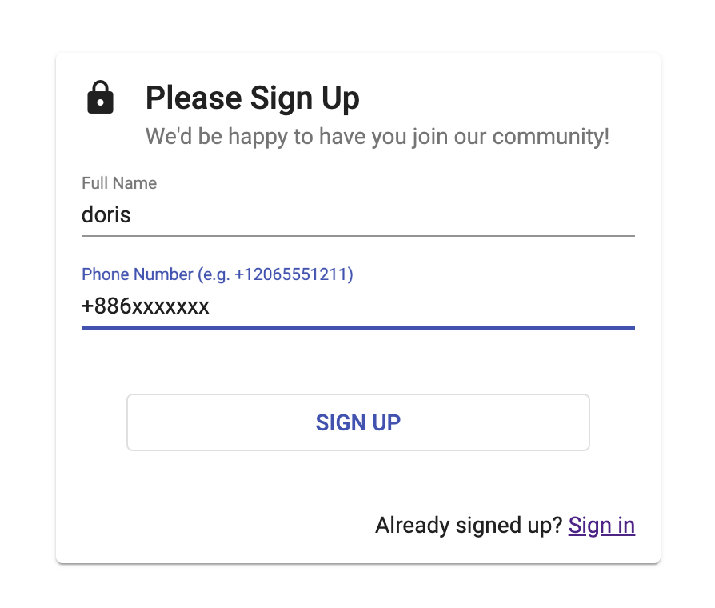
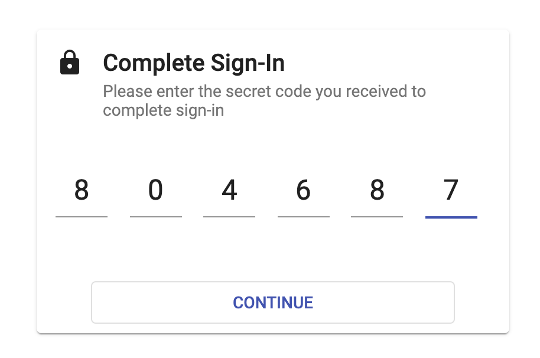
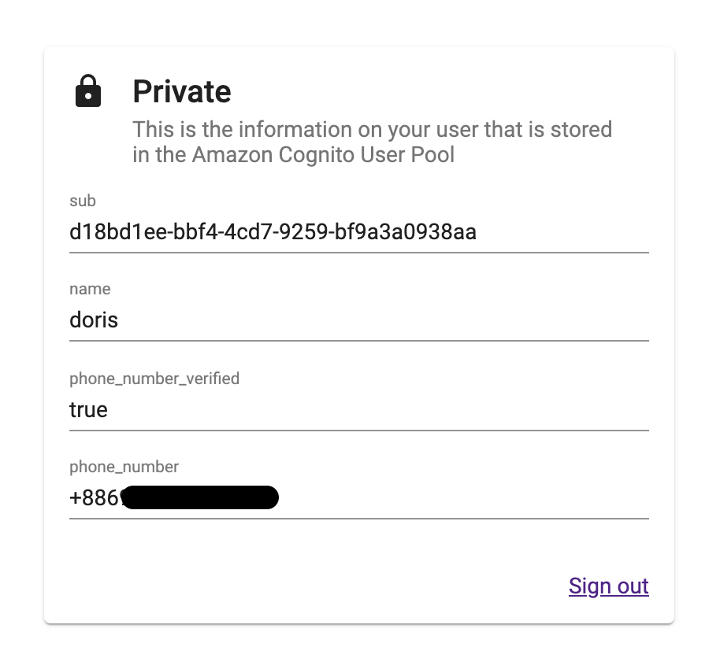

# Cognito Passwordless SMS Auth - WebClient (Angular)

This is a client web app that provides custom passwordless sign-up and sign-in pages to authenticate against an Amazon Cognito user pool via custom authentication challenge flow with Lambda triggers.

## Run the web client

Once the backend is deployed, run the web client to demonstrate the passwordless authentication flow via SMS.

1. Clone this repo
   `git clone https://github.com/shazi7804/aws-cognito-passwordless-sms-auth.git`
2. Enter webClient directory: `cd client/web`
3. Install dependencies: `npm install`
4. Enter your AWS region, Cognito user pool ID and your Web App Client ID in this file: `src/environments/environment.ts`. You can get this information from the CloudFormation stack outputs of the serverless repo deployment.
5. Run the web app locally: `npm run start`

The web app client should be running at http://localhost:4200 allowing you to register a new user with full name and phone number and login with only the registered phone number.

## User Sign-in pipeline

1. Sign-in page with `Full Name` and `Phone Numner`

2. Enter secret code from SMS.

3. Show user information from Cognito User Pool

### License Summary

This sample code is made available under a modified MIT license. See the LICENSE file.
